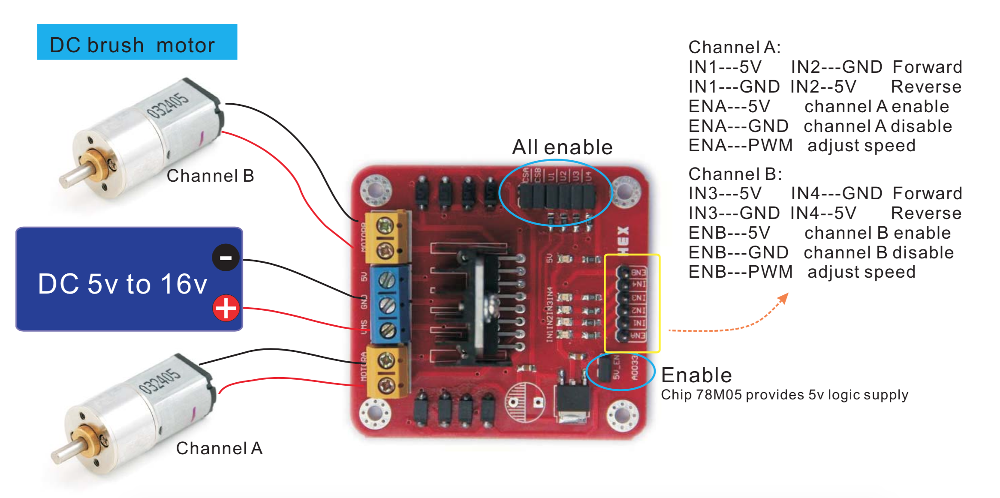

# Joy-It Talking-Pi pinout

Toy car with 2 DC motors which are controlled with  raspberry Pi and L293d motor-shield.  

Talking-Pi shield has connection to Google Assistant API. Talking -Pi shield pinout:
